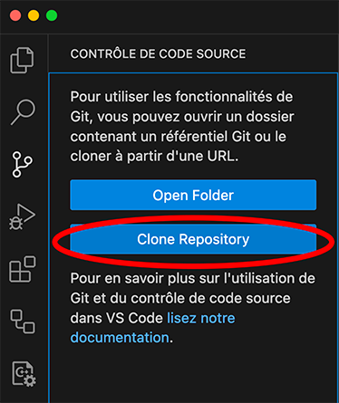

# Cloner ce dépôt sur votre machine

Voici deux façons pour cloner ce dépôt sur votre machine.

## Terminal 💪

Ouvrer votre terminal et aller au dossier où vous voulez cloner le dépôt.
Ensuite, exécuter la commande suivante :

```bash
git clone https://github.com/archambaultv-prof/2025H-420-910-MA-Pithon.git
```

Ceci va créer le dossier `2025H-420-910-MA-Pithon` dans le dossier où vous êtes.

## VSCode 🖥️

Ouvrer VSCode et aller à l'onglet `Contrôle de code source`. 


Ensuite, cliquer sur le bouton `Clone Repository`.



Coller l'URL du dépôt et choisir le dossier où vous voulez le cloner.

